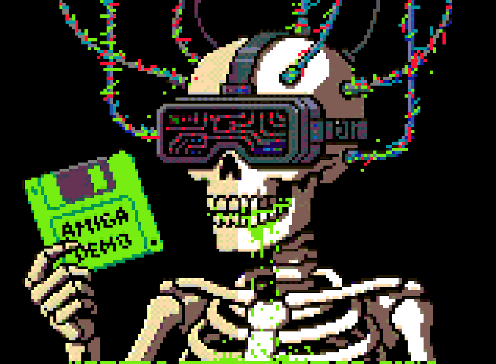

<!--
  Replace this with your own banner image (illustration, workspace photo, etc).
  Free options: unDraw (undraw.co), Storyset (storyset.com), or your own artwork.
  Upload it to this repo (e.g. assets/banner.png) and point the src below at it.
-->

 

<table width="100%">
<tr>
<td width="75%" valign="top">

### Hey! I'm Chirag Singh 👋

Full-Stack Web Developer | B.Tech CSE @ IIIT Kota

Building real-time, full-stack apps with the MERN stack — clean architecture, fast UIs, systems that hold up under load.

🌱 **Currently learning:** System design & advanced DSA
🛠️ **I enjoy:** Competitive programming, real-time apps, clean UI/UX, side projects
🎯 **Obsessed with:** Sub-100ms real-time systems, secure auth flows, shipping end-to-end

📫 **Reach me:** [chiragcse05@gmail.com](mailto:chiragcse05@gmail.com)

</td>
<td width="25%" align="center">

<!--
  Replace this with your own photo or avatar.
  Upload it to this repo (e.g. assets/avatar.png) and point the src below at it.
-->

</td>
</tr>
</table>

---

### 🧰 Languages & Tools

---

### 📈 Contribution Graph

---

### 🌐 Connect with me

[LinkedIn](https://linkedin.com/in/chirag-singh-51a775324/) • [GitHub](https://github.com/Chiragsinghh) • [Email](mailto:chiragcse05@gmail.com)

 

Pin your favorite repos and your real contribution graph will appear automatically below this README on your GitHub profile page — go to your profile → <b>Customize your pins</b> to set that up.
